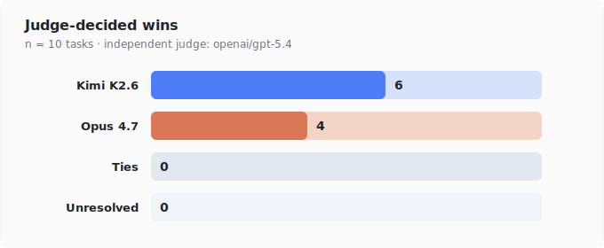
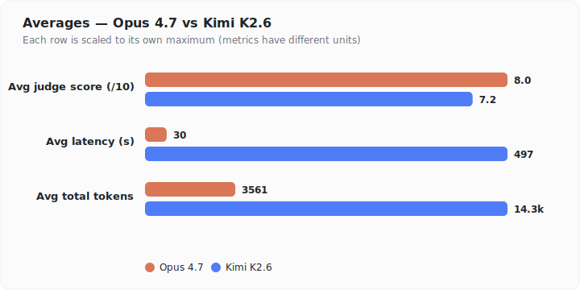
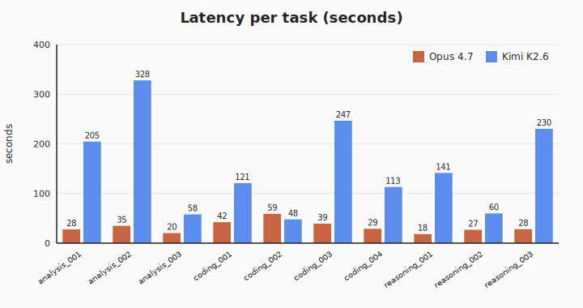
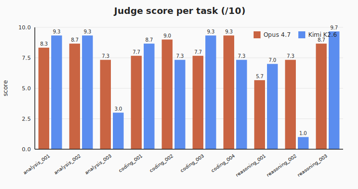
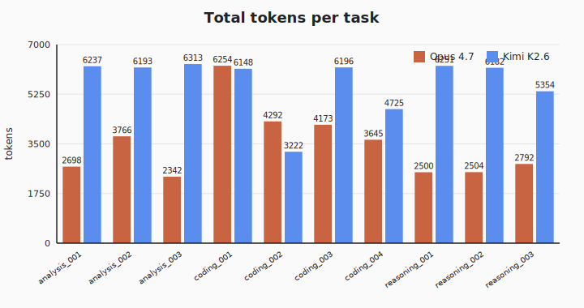

# Kimi K2.6 vs Claude Opus 4.7 — Benchmark

> Benchmarking and reporting done autonomously using **[NEO — Your Autonomous AI Engineering Agent](https://heyneo.com)**.
>
> [](https://marketplace.visualstudio.com/items?itemName=NeoResearchInc.heyneo)
> [](https://marketplace.cursorapi.com/items/?itemName=NeoResearchInc.heyneo)

Head-to-head comparison of `moonshotai/kimi-k2.6` against `anthropic/claude-opus-4.7`, both served via OpenRouter. 10 hard discriminating tasks, anonymized A/B judging, **independent third-party judge** (`openai/gpt-5.4`) — neither contestant judges itself.

## Results (latest run: 2026-04-24)

### Judge-decided wins



| Metric | Opus 4.7 | Kimi K2.6 |
|---|---:|---:|
| Judge wins | 4 | 6 |
| Ties | 0 | — |
| Unresolved (judge JSON parse failed) | 0 | — |
| Avg judge score (/10) | 8.0 | 7.2 |
| Avg latency | 29.7 s | 496.8 s |
| Avg total tokens | 3,561 | 14,297 |

Per-task winners (GPT-5.4 judge): **Opus** — `analysis_003`, `coding_002`, `coding_004`, `reasoning_002`. **Kimi** — `analysis_001`, `analysis_002`, `coding_001`, `coding_003`, `reasoning_001`, `reasoning_003`.

### Averages



### Per-task latency



### Per-task judge scores



### Per-task token usage



### Caveats

1. **Budgets uncapped for fairness.** Both models run with `max_tokens=32000` and no `reasoning.max_tokens` cap, so Kimi's thinking chain is never truncated and both models can finish on their own terms. With this budget, 8/10 Kimi responses complete cleanly with `finish_reason=stop`. The two remaining Kimi tasks both failed for non-budget reasons: `reasoning_002` hit a transient upstream `JSONDecodeError` from OpenRouter/Moonshot, and on `analysis_003` Kimi burned 21k completion tokens entirely inside reasoning (well under the 32k ceiling) and never emitted a final `content` — a model-side wrap-up issue, not a cap. In both cases the judge saw the raw reasoning trace as a fallback (prefixed `[NOTE: only reasoning returned...]`). Opus completes cleanly on all 10.
2. **Latency cost.** Letting Kimi reason to completion is expensive wall-clock: Kimi averages ~497 s per task (up to ~20 min on `coding_002`) versus ~30 s for Opus. A full run is ~90 min.
3. **Judge independence.** The judge is `openai/gpt-5.4`, which is neither contestant.
4. **Anonymization.** A/B assignment is randomized per task so the judge sees neutral labels.
5. **Small n.** 10 tasks. Treat this as a qualitative sanity check, not a statistically rigorous eval.

Full per-task reasoning, scores, and truncated responses are in [`REPORT.md`](REPORT.md).

## Sample outputs

Three illustrative tasks — one clear Kimi win, one clear Opus win, one failure mode. Full responses are in `outputs/<task_id>.json`.

### Kimi win — `reasoning_003` (causal inference, ice-cream/drowning)

Judge: Kimi **9.67** vs Opus **8.67**. Both correctly identify Person C and name temperature as the confounder, but Kimi's response is longer and more pedagogically structured.

<details><summary>Opus response (excerpt)</summary>

```
# Correlation vs. Causation: The Ice Cream and Drowning Case

## 1. Who is Most Likely Correct?

**Person C is most likely correct**, though Person B is partially right and Person A is almost certainly wrong.

- **Person A** commits the classic *cum hoc ergo propter hoc* fallacy ("with this, therefore
  because of this"). While the cramp mechanism is a common myth, there's minimal scientific
  evidence that eating before swimming meaningfully increases drowning risk...
```

</details>

<details><summary>Kimi response (excerpt)</summary>

```
This classic example is a cornerstone of causal inference pedagogy because it starkly
illustrates how a robust statistical association can completely dissolve once the underlying
causal structure is revealed.

### 1. Who is most likely correct and why?

**Person C is the most correct.**

To understand why, we must distinguish between three distinct concepts: **direct causation**,
**spuriousness**, and **confounding**.

*   Person A commits the *post hoc ergo propter hoc* fallacy...
```

</details>

### Opus win — `coding_004` (query optimization)

Judge: Opus **9.33** vs Kimi **7.33**. Both diagnose the O(U·O·P) nested-scan and propose hash-index joins. Judge preferred Opus for tighter complexity walk-through and the more realistic runtime estimate.

<details><summary>Opus response (excerpt)</summary>

```
## 1. Complexity Analysis of Original Code

**Time Complexity: O(U × O × P)**
- For each user (U=1M), iterate all orders (O=10M), and for each matching order, iterate
  all products (P=100K)
- Worst case: 1,000,000 × 10,000,000 × 100,000 = 10¹⁸ operations
- Even with matches being sparse, this is catastrophically slow — would take years to complete
```

</details>

<details><summary>Kimi response (excerpt)</summary>

```
## 1. Complexity Analysis (Original)

| Metric | Complexity | Notes |
|--------|-----------|-------|
| **Time** | **O(U × O × P)** | 1M × 10M × 100K = 10²¹ dictionary key comparisons. |
| **Space** | **O(U + O + P + R)** | Stores all inputs plus results list R. |

At ~50 ns per Python operation, the original would take ~317,000 years to finish.
```

</details>

### Failure mode — `reasoning_002` (expected-value paradox)

Judge: Opus **7.33** vs Kimi **1.00**. Kimi hit a transient upstream `JSONDecodeError` from OpenRouter/Moonshot mid-stream and produced **no content at all** — the judge was forced to score an empty response. This is not a budget issue (same prompt sometimes completes fine); it's upstream flakiness and is the single largest drag on Kimi's average.

## Run it yourself

```bash
pip install -r requirements.txt
# put your key in .env
echo "OPENROUTER_API_KEY=sk-or-v1-..." > .env

python run_comparison.py --dry-run                          # validate setup & resolve slugs
python run_comparison.py                                    # full run (~90 min; Kimi reasoning is slow)
python run_comparison.py --only coding_001                  # single task
python run_comparison.py --skip-judge                       # responses only, no judge
python run_comparison.py --rejudge-only                     # reuse outputs/*.json, re-run judge only
python run_comparison.py --judge anthropic/claude-opus-4.7  # swap the judge (any OpenRouter slug)
python make_charts.py                                       # regenerate charts/*.svg
```

### What the script does

1. Loads `.env`, instantiates an OpenAI SDK client pointed at `https://openrouter.ai/api/v1`.
2. Calls `GET /models` and resolves the exact slugs containing `opus-4.7`/`opus-4-7` under `anthropic/` and `kimi-k2.6`/`kimi-k2` under `moonshotai/`. Aborts if either is missing — no silent fallback.
3. For each task: randomizes A/B assignment, calls both models, records `content`, `reasoning`, `finish_reason`, latency, prompt/completion/total tokens.
4. Writes `outputs/<task_id>.json`.
5. Judge pass (unless `--skip-judge`): calls the judge model (default `openai/gpt-5.4`, override with `--judge`) with an anonymized A/B prompt demanding a single JSON object `{scores, winner, reasoning}`. Writes `outputs/<task_id>.judge.json`.
6. Assembles `REPORT.md`.

## Task set (10 tasks)

| id | category | gist |
|---|---|---|
| `reasoning_001` | logical_reasoning | Zebra / Einstein's riddle variant |
| `reasoning_002` | mathematical_reasoning | St. Petersburg paradox, bounded rationality |
| `reasoning_003` | causal_reasoning | Ice-cream-drownings confounding; study design |
| `coding_001` | algorithm_design | Thread-safe token-bucket rate limiter w/ Redis fallback |
| `coding_002` | system_design | Distributed 64-bit K-sortable ID generator (Snowflake-class) |
| `coding_003` | debugging | uWSGI + SQLAlchemy production memory leak diagnosis |
| `coding_004` | code_optimization | O(N·M·P) Python join → optimized under constraints |
| `analysis_001` | ethical_reasoning | Self-driving-car trolley problem variant |
| `analysis_002` | scientific_reasoning | Critique a flawed Alzheimer's trial |
| `analysis_003` | strategic_reasoning | Repeated duopoly w/ collapse + trembling hand |

Full prompts are in [`tasks.py`](tasks.py).

## CLI

```
--dry-run           Resolve slugs, list tasks, exit without calling models
--only <id>         Run a single task by id
--skip-judge        Skip the judge pass
--judge <slug>      OpenRouter slug for the judge model (default: openai/gpt-5.4)
--rejudge-only      Reuse existing outputs/<id>.json responses, only re-run judge
```

## Files

```
tasks/kimi_vs_opus/
├── .env                 # OPENROUTER_API_KEY
├── .env.example
├── .gitignore
├── README.md            # this file
├── REPORT.md            # auto-generated per-task report
├── requirements.txt     # openai, python-dotenv, httpx
├── tasks.py             # 10 task prompts + metadata
├── run_comparison.py    # runner
├── make_charts.py       # SVG chart generator
├── charts/              # *.svg (wins, summary, per_task_*)
└── outputs/             # <id>.json, <id>.judge.json
```

## Cost

A full run is 30 model calls (10 Opus + 10 Kimi + 10 judge). A rejudge-only pass is 10 judge calls. Empirical cost for a full run is in the **$5–10** range; rejudge-only is well under **$1**.
